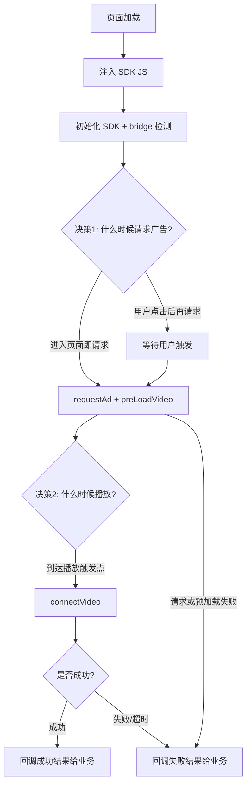

业务同学拿到本工程后：先上传 `unified-reward-bridge.js`、`demo/business-inject-demo.html`、`docs/业务同学注入接入.md` 到同一个 GitHub 仓库，再让 AI 按本文件执行提问与接入流程。

# 业务同学注入接入（AI 读取执行版）

这份文档是给业务 AI 的执行指令。

你的任务：
1. 先问清业务决策问题。
2. 再把 SDK JS 注入到业务 H5。
3. 最后返回统一成功/失败结果给业务。

## 0. 硬约束（必须遵守）

1. 必须在 App WebView 打开：非 App WebView 环境直接判失败，不允许当作可用环境。
2. 不允许删掉 iOS/Android 自动判断与路由逻辑。
3. 不允许业务侧改动底层广告固定字段（例如 `pgid`、`origin`、`sdk_id` 等来源于客户端/广告配置的字段）。
4. 不允许把失败当成功：请求、预加载、播放任一环节异常或超时，必须返回 `status=fail`。
5. 不允许移除 `detectBridge` 检测步骤。

## 0.1 可由业务自行决定（允许配置）

1. 请求时机：进入页面请求，或用户点击后请求。
2. 播放触发点：按钮点击、关卡失败弹窗、结算页等。
3. 成功后处理：发奖策略、是否服务端二次确认。
4. 失败后处理：业务自己的 Plan B（文档只返回失败结果，不内置兜底）。
5. 页面加载时机：何时注入 JS 可由业务决定，但建议尽早注入。

## 1. AI 必问问题（按顺序提问）

1. 你们游戏里“看广告”入口在哪个页面/哪个关卡？
2. 请求广告时机是：进入页面就请求，还是用户点击后再请求？
3. 广告播放由哪个具体动作触发？（按钮点击、失败弹窗、关卡结束等）
4. 成功后你们业务怎么处理？
5. 失败后你们业务怎么处理？

提问完成后，必须生成这份决策 JSON（字段名固定）：

```json
{
  "entry": "battle_fail_popup",
  "request_timing": "after_click",
  "play_trigger": "click_reward_button",
  "success_rule": "biz_defined",
  "failure_rule": "return_fail_result"
}
```

## 2. 决策节点流程图



## 3. AI 执行流程（固定步骤）

1. 读取并确认业务决策 JSON。
2. 在业务 H5 注入 `unified-reward-bridge.js`。
3. 调 `detectBridge` 检查 bridge。
4. 按业务时机执行：
- `requestAndPreload`
- `show` 或 `requestPreloadAndShow`
5. 将结果统一回调给业务。

## 4. 可直接复制到业务 H5 的代码

### 4.1 注入 SDK JS

```html
<script>
  function injectUnifiedRewardSdk(src) {
    return new Promise(function (resolve, reject) {
      if (window.UnifiedRewardSDK) {
        resolve();
        return;
      }
      var s = document.createElement('script');
      s.src = src;
      s.async = true;
      s.onload = function () {
        if (!window.UnifiedRewardSDK) {
          reject(new Error('SDK 已加载，但未找到 UnifiedRewardSDK'));
          return;
        }
        resolve();
      };
      s.onerror = function () {
        reject(new Error('SDK 注入失败，请检查 JS 地址'));
      };
      document.head.appendChild(s);
    });
  }
</script>
```

### 4.2 统一执行入口（只回成功/失败）

```html
<script>
  function reportBizResult(result) {
    // 交给业务方自行处理成功/失败后的逻辑
    console.log('reward_result', result);
  }

  async function runRewardFlow(decision) {
    await injectUnifiedRewardSdk('https://你的域名/unified-reward-bridge.js');

    window.__UNIFIED_REWARD_CONFIG = {
      platform: 'auto',
      behavior: {
        callbackTimeout: 8000,
        bridgeDetectTimeout: 5000
      },
      reward: {
        data: JSON.stringify({
          entry: decision.entry,
          play_trigger: decision.play_trigger
        })
      }
    };

    var sdk = window.UnifiedRewardSDK.create();

    await new Promise(function (resolve, reject) {
      sdk.detectBridge(function (err) {
        if (err) {
          reject(new Error('bridge 不可用：' + err.message));
          return;
        }
        resolve();
      });
    });

    sdk.requestPreloadAndShow(function (err, detail) {
      if (err) {
        reportBizResult({
          status: 'fail',
          stage: 'request_preload_or_show',
          reason: err.message,
          detail: null
        });
        return;
      }

      reportBizResult({
        status: 'success',
        stage: 'show_triggered',
        reason: '',
        detail: detail
      });
    });
  }
</script>
```

## 5. 统一失败结果格式（必须返回）

```json
{
  "status": "fail",
  "stage": "request|preload|show|bridge",
  "reason": "错误信息",
  "detail": null
}
```

示例：请求广告 8 秒未返回：

```json
{
  "status": "fail",
  "stage": "request",
  "reason": "adRequest 回调超时",
  "detail": null
}
```

## 6. 重要提醒

- 真广告只能在 App WebView 内运行。
- iOS/Android 自动路由到对应广告请求。
- bridge 检测失败通常是域名未注入，找客户端加白名单。

## 7. 本工程里业务同学直接可用的文件

- `UnifiedRewardSDK/unified-reward-bridge.js`
- `UnifiedRewardSDK/demo/business-inject-demo.html`
- `UnifiedRewardSDK/docs/业务同学注入接入.md`
